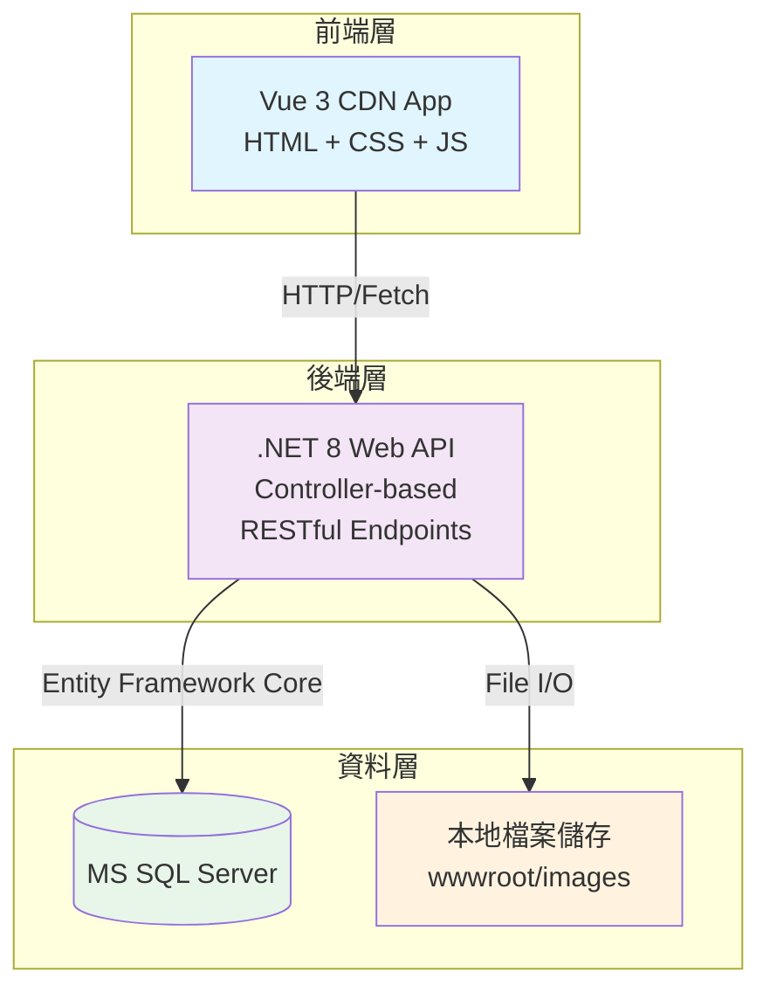
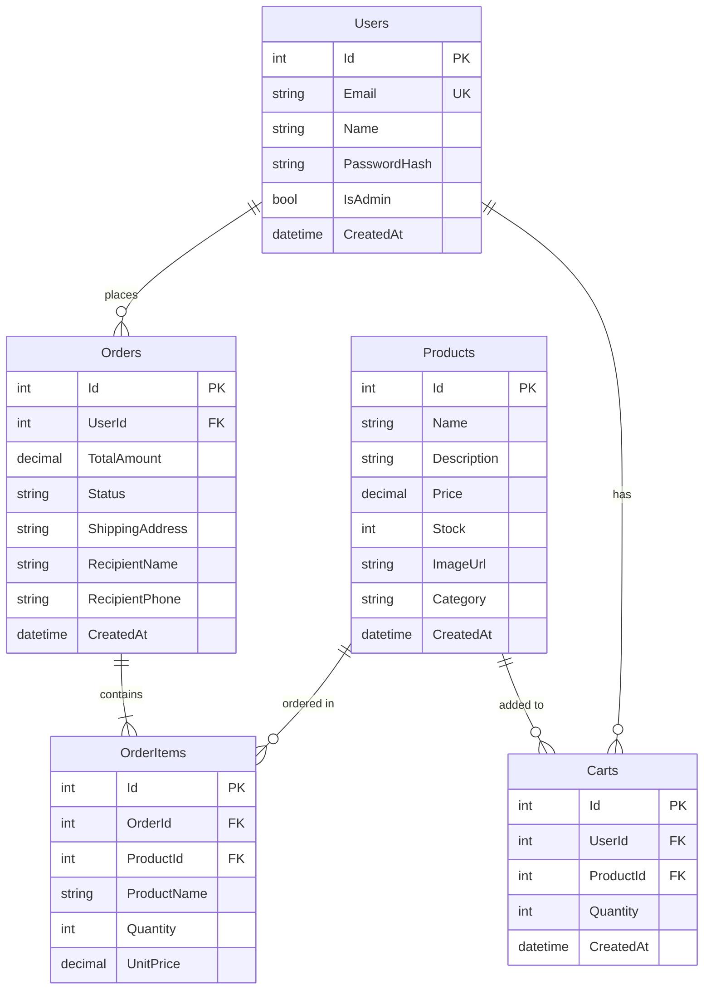

# 電子商務開發專案技術規格書 (輕量版 Side Project)

## 一、專案簡介與目標

本專案為輕量級電子商務平台Side Project，聚焦核心功能：商品瀏覽、購物車、訂單管理與基礎會員系統。採用簡單直接的技術棧，避免過度工程化，適合快速開發與學習。

**主要目標：**
- 提供完整的電商核心功能體驗
- 採用輕量技術棧，降低開發與維護成本
- 無需複雜編譯打包流程
- 避免第三方API依賴，方便本地開發測試
- 遵循TDD開發流程，確保程式碼品質

**專案特色：**
- ✅ 前端無編譯：Vue 3 CDN版本，開箱即用
- ✅ 後端採用：.NET 8 Web API (Controller-based)
- ✅ 企業級資料庫：MS SQL Server
- ✅ 本地檔案儲存：無需雲端服務
- ✅ 模擬支付：無需金流API串接

---

## 二、系統整體架構

### 架構圖



### 架構說明

**前端：**
- 使用Vue 3 CDN版本，透過`<script>`標籤引入
- 採用Pico.css輕量UI框架
- 使用原生Fetch API呼叫後端API
- JWT Token存於localStorage
- 支援多頁面應用(MPA)或單頁應用(SPA)皆可

**後端：**
- .NET 8 Web API 架構 (Controller-based)
- Entity Framework Core處理資料存取
- 簡易JWT認證機制
- CORS設定允許前端跨域請求
- 商品圖片儲存於wwwroot/images

**資料庫：**
- 開發環境使用 MS SQL Server LocalDB
- 生產環境使用 MS SQL Server
- Entity Framework Core Code First建立Schema

---

## 三、前端技術規格

### 技術選型

| 技術項目 | 選擇方案 | 說明 |
|---------|---------|------|
| **核心框架** | Vue 3 (CDN) | 透過unpkg.com引入，無需Node.js環境 |
| **UI框架** | Pico.css | 輕量語義化CSS，僅10KB |
| **HTTP請求** | Fetch API | 原生瀏覽器API，無需額外套件 |
| **路由** | Hash Router / 多頁面 | 簡易實作或直接用多個HTML |
| **狀態管理** | Vue 3 Reactive | 使用ref/reactive，無需Vuex |
| **開發工具** | VSCode + Live Server | 無需打包工具 |

### 檔案結構規格

```
frontend/
├── index.html          # 商品列表頁
├── product.html        # 商品詳情頁
├── cart.html           # 購物車頁
├── checkout.html       # 結帳頁
├── orders.html         # 訂單列表頁
├── login.html          # 登入/註冊頁
├── admin.html          # 後台管理頁
├── css/
│   └── custom.css      # 自訂樣式
└── js/
    ├── api.js          # API呼叫封裝
    └── auth.js         # 認證相關工具
```

### 功能模組規格

#### 1. 商品瀏覽模組 (index.html, product.html)
**需求：**
- 顯示商品列表（卡片式佈局）
- 商品資訊包含：圖片、名稱、價格、簡述
- 點擊商品進入詳情頁
- 商品詳情頁顯示完整描述、庫存狀態
- 提供「加入購物車」按鈕
- 支援簡易分類篩選（可選）

**API端點需求：**
- `GET /api/products` - 取得商品列表
- `GET /api/products/{id}` - 取得商品詳情

**前端狀態管理：**
- 商品列表資料 (products[])
- 購物車數量徽章 (cartCount)
- 登入狀態 (isLoggedIn)

#### 2. 購物車模組 (cart.html)
**需求：**
- 顯示購物車內所有商品
- 每項商品顯示：名稱、單價、數量、小計
- 可調整商品數量（即時更新）
- 可移除商品
- 顯示購物車總金額
- 提供「前往結帳」按鈕（需登入）

**API端點需求：**
- `POST /api/cart/add` - 加入商品到購物車 [需認證]
- `GET /api/cart` - 取得購物車內容 [需認證]
- `PUT /api/cart/{id}` - 更新商品數量 [需認證]
- `DELETE /api/cart/{id}` - 移除商品 [需認證]

**商業邏輯：**
- 重複加入同一商品應累加數量
- 數量調整需即時更新總金額
- 未登入時提示登入

#### 3. 會員系統模組 (login.html)
**需求：**
- 會員註冊表單（Email、姓名、密碼）
- 會員登入表單（Email、密碼）
- 登入成功後儲存JWT Token至localStorage
- 導航列顯示登入狀態與登出功能
- 密碼需加密儲存（後端BCrypt）

**API端點需求：**
- `POST /api/auth/register` - 會員註冊
- `POST /api/auth/login` - 會員登入
- `GET /api/auth/me` - 取得個人資料 [需認證]

**Request/Response 規格：**
```
註冊 Request:
{
  "email": "user@example.com",
  "name": "使用者名稱",
  "password": "密碼"
}

登入 Request:
{
  "email": "user@example.com",
  "password": "密碼"
}

登入 Response:
{
  "token": "JWT Token字串",
  "user": {
    "id": 1,
    "name": "使用者名稱",
    "email": "user@example.com"
  }
}
```

#### 4. 訂單流程模組 (checkout.html, orders.html)
**需求：**
- 結帳頁面顯示購物車明細與總金額
- 收件資訊表單（收件人、電話、地址）
- 送出訂單後清空購物車
- 訂單列表頁顯示歷史訂單
- 訂單詳情頁顯示完整訂單資訊與狀態

**API端點需求：**
- `POST /api/orders` - 建立訂單 [需認證]
- `GET /api/orders` - 取得個人訂單列表 [需認證]
- `GET /api/orders/{id}` - 取得訂單詳情 [需認證]

**建立訂單 Request 規格：**
```
{
  "recipientName": "收件人姓名",
  "recipientPhone": "0912345678",
  "shippingAddress": "完整收件地址"
}
```

**商業邏輯：**
- 訂單建立時應扣減商品庫存
- 庫存不足時應拒絕訂單
- 訂單建立後清空購物車
- 訂單狀態預設為「Pending」
- 只能查看自己的訂單

#### 5. 後台管理模組 (admin.html)
**需求：**
- 商品管理：新增、編輯、刪除商品
- 訂單管理：檢視所有訂單、更新訂單狀態
- 需管理員權限才能存取

**API端點需求：**
- `POST /api/products` - 新增商品 [需管理員權限]
- `PUT /api/products/{id}` - 更新商品 [需管理員權限]
- `DELETE /api/products/{id}` - 刪除商品 [需管理員權限]
- `GET /api/admin/orders` - 取得所有訂單 [需管理員權限]
- `PUT /api/orders/{id}/status` - 更新訂單狀態 [需管理員權限]

**權限控管：**
- 前端需檢查使用者角色
- 後端API需驗證JWT的Role Claim

---

## 四、後端API規格

### 技術選型

| 技術項目 | 選擇方案 | 說明 |
|---------|---------|------|
| **框架** | .NET 8 Web API | Controller-based Web API |
| **ORM** | Entity Framework Core 8 | Code First資料存取 |
| **資料庫** | MS SQL Server | 企業級關聯式資料庫 |
| **認證** | JWT Token | 無狀態認證機制 |
| **API文件** | Swagger / OpenAPI | 自動產生API文件 |
| **測試框架** | xUnit + FluentAssertions | TDD單元測試 |
| **密碼加密** | BCrypt.Net | 安全密碼雜湊 |

### 專案結構規格

```
ECommerceAPI/
├── Program.cs                  # 應用程式進入點
├── Startup.cs                  # 服務設定與中介軟體管線
├── appsettings.json            # 設定檔
├── Controllers/                # API 控制器
│   ├── ProductsController.cs
│   ├── AuthController.cs
│   ├── CartController.cs
│   ├── OrdersController.cs
│   └── AdminController.cs
├── Models/                     # 資料模型
│   ├── Product.cs
│   ├── User.cs
│   ├── Order.cs
│   ├── OrderItem.cs
│   └── Cart.cs
├── Data/
│   └── AppDbContext.cs         # EF Core DbContext
├── DTOs/                       # 資料傳輸物件
│   ├── LoginRequest.cs
│   ├── RegisterRequest.cs
│   ├── CreateOrderRequest.cs
│   └── ApiResponse.cs
├── Services/                   # 商業邏輯層
│   ├── IProductService.cs
│   ├── ProductService.cs
│   ├── IOrderService.cs
│   └── OrderService.cs
├── Helpers/
│   └── JwtHelper.cs            # JWT工具
├── Middleware/
│   └── ExceptionHandlingMiddleware.cs
├── Tests/                      # 單元測試
│   ├── ProductServiceTests.cs
│   └── OrderServiceTests.cs
└── wwwroot/
    └── images/                 # 商品圖片儲存
```

### API端點規格

#### 商品管理 API

| Method | Endpoint | 說明 | 認證 | 權限 |
|--------|----------|------|------|------|
| GET | /api/products | 取得商品列表 | ❌ | - |
| GET | /api/products/{id} | 取得商品詳情 | ❌ | - |
| POST | /api/products | 新增商品 | ✅ | Admin |
| PUT | /api/products/{id} | 更新商品 | ✅ | Admin |
| DELETE | /api/products/{id} | 刪除商品 | ✅ | Admin |

**商品資料規格：**
```
Product {
  id: int (自動產生)
  name: string (必填, max 100)
  description: string (max 500)
  price: decimal (必填, >= 0)
  stock: int (必填, >= 0)
  imageUrl: string (max 200)
  category: string (max 50)
  createdAt: datetime (自動產生)
}
```

#### 會員管理 API

| Method | Endpoint | 說明 | 認證 | 權限 |
|--------|----------|------|------|------|
| POST | /api/auth/register | 會員註冊 | ❌ | - |
| POST | /api/auth/login | 會員登入 | ❌ | - |
| GET | /api/users/me | 取得個人資料 | ✅ | User |

**會員資料規格：**
```
User {
  id: int (自動產生)
  email: string (必填, unique, max 100)
  name: string (必填, max 50)
  passwordHash: string (BCrypt雜湊)
  isAdmin: bool (預設 false)
  createdAt: datetime (自動產生)
}
```

**密碼規則：**
- 最少8字元
- 需包含英文與數字

#### 購物車 API

| Method | Endpoint | 說明 | 認證 | 權限 |
|--------|----------|------|------|------|
| POST | /api/cart/add | 加入商品 | ✅ | User |
| GET | /api/cart | 取得購物車 | ✅ | User |
| PUT | /api/cart/{id} | 更新數量 | ✅ | User |
| DELETE | /api/cart/{id} | 移除商品 | ✅ | User |

**購物車資料規格：**
```
Cart {
  id: int (自動產生)
  userId: int (FK to User)
  productId: int (FK to Product)
  quantity: int (必填, > 0)
  createdAt: datetime (自動產生)
}
```

**商業邏輯規則：**
- 同一使用者對同一商品只能有一筆記錄
- 重複加入時應累加數量而非新增記錄
- 購物車項目需關聯到有效的商品

#### 訂單 API

| Method | Endpoint | 說明 | 認證 | 權限 |
|--------|----------|------|------|------|
| POST | /api/orders | 建立訂單 | ✅ | User |
| GET | /api/orders | 取得個人訂單 | ✅ | User |
| GET | /api/orders/{id} | 取得訂單詳情 | ✅ | User |
| GET | /api/admin/orders | 取得所有訂單 | ✅ | Admin |
| PUT | /api/orders/{id}/status | 更新訂單狀態 | ✅ | Admin |

**訂單資料規格：**
```
Order {
  id: int (自動產生)
  userId: int (FK to User)
  totalAmount: decimal (自動計算)
  status: string (Pending/Paid/Shipped/Completed)
  shippingAddress: string (必填, max 200)
  recipientName: string (必填, max 50)
  recipientPhone: string (必填, max 20)
  createdAt: datetime (自動產生)
  items: OrderItem[] (關聯)
}

OrderItem {
  id: int (自動產生)
  orderId: int (FK to Order)
  productId: int (FK to Product)
  productName: string (商品名稱快照)
  quantity: int (購買數量)
  unitPrice: decimal (單價快照)
}
```

**建立訂單商業邏輯：**
1. 驗證購物車非空
2. 檢查所有商品庫存是否足夠
3. 建立訂單主檔
4. 複製購物車項目到訂單明細（儲存商品名稱與價格快照）
5. 扣減商品庫存
6. 清空購物車
7. 回傳訂單資料

**訂單狀態流轉：**
- `Pending` → `Paid` → `Shipped` → `Completed`
- 只有管理員可更新狀態

---

## 五、資料庫設計規格

### 技術選型
- **開發環境：** MS SQL Server LocalDB (隨 Visual Studio 安裝)
- **生產環境：** MS SQL Server 2019+ / Azure SQL Database
- **ORM：** Entity Framework Core 8 (Code First)

### 資料表結構規格

#### Products (商品表)
| 欄位名稱 | 資料型別 | 限制 | 說明 |
|---------|---------|------|------|
| Id | int | PK, Identity | 商品編號 |
| Name | nvarchar(100) | NOT NULL | 商品名稱 |
| Description | nvarchar(500) | NULL | 商品描述 |
| Price | decimal(18,2) | NOT NULL, >= 0 | 商品價格 |
| Stock | int | NOT NULL, >= 0 | 庫存數量 |
| ImageUrl | nvarchar(200) | NULL | 圖片URL |
| Category | nvarchar(50) | NULL | 商品分類 |
| CreatedAt | datetime | NOT NULL, Default NOW | 建立時間 |

**索引：**
- 主鍵：Id
- 建議索引：Category (加速分類查詢)

#### Users (會員表)
| 欄位名稱 | 資料型別 | 限制 | 說明 |
|---------|---------|------|------|
| Id | int | PK, Identity | 會員編號 |
| Email | nvarchar(100) | NOT NULL, UNIQUE | 電子郵件 |
| Name | nvarchar(50) | NOT NULL | 會員名稱 |
| PasswordHash | nvarchar(200) | NOT NULL | 密碼雜湊值 |
| IsAdmin | bit | NOT NULL, Default 0 | 是否為管理員 |
| CreatedAt | datetime | NOT NULL, Default NOW | 註冊時間 |

**索引：**
- 主鍵：Id
- 唯一索引：Email (確保Email唯一)

#### Orders (訂單主檔)
| 欄位名稱 | 資料型別 | 限制 | 說明 |
|---------|---------|------|------|
| Id | int | PK, Identity | 訂單編號 |
| UserId | int | FK → Users.Id | 會員編號 |
| TotalAmount | decimal(18,2) | NOT NULL, >= 0 | 訂單總金額 |
| Status | nvarchar(20) | NOT NULL | 訂單狀態 |
| ShippingAddress | nvarchar(200) | NOT NULL | 收件地址 |
| RecipientName | nvarchar(50) | NOT NULL | 收件人姓名 |
| RecipientPhone | nvarchar(20) | NOT NULL | 收件人電話 |
| CreatedAt | datetime | NOT NULL, Default NOW | 訂單建立時間 |

**索引：**
- 主鍵：Id
- 外鍵索引：UserId (加速查詢會員訂單)
- 建議索引：Status (加速訂單狀態查詢)

#### OrderItems (訂單明細)
| 欄位名稱 | 資料型別 | 限制 | 說明 |
|---------|---------|------|------|
| Id | int | PK, Identity | 明細編號 |
| OrderId | int | FK → Orders.Id | 訂單編號 |
| ProductId | int | FK → Products.Id | 商品編號 |
| ProductName | nvarchar(100) | NOT NULL | 商品名稱快照 |
| Quantity | int | NOT NULL, > 0 | 購買數量 |
| UnitPrice | decimal(18,2) | NOT NULL, >= 0 | 單價快照 |

**索引：**
- 主鍵：Id
- 外鍵索引：OrderId (加速訂單明細查詢)

**刪除行為：**
- Orders刪除時，關聯的OrderItems應級聯刪除

#### Carts (購物車)
| 欄位名稱 | 資料型別 | 限制 | 說明 |
|---------|---------|------|------|
| Id | int | PK, Identity | 購物車編號 |
| UserId | int | FK → Users.Id | 會員編號 |
| ProductId | int | FK → Products.Id | 商品編號 |
| Quantity | int | NOT NULL, > 0 | 商品數量 |
| CreatedAt | datetime | NOT NULL, Default NOW | 加入時間 |

**索引：**
- 主鍵：Id
- 複合唯一索引：(UserId, ProductId) (確保同一會員對同一商品只有一筆記錄)

### ER Diagram



### 資料完整性規則

1. **參考完整性：**
   - Orders.UserId → Users.Id
   - OrderItems.OrderId → Orders.Id (ON DELETE CASCADE)
   - OrderItems.ProductId → Products.Id
   - Carts.UserId → Users.Id
   - Carts.ProductId → Products.Id

2. **唯一性約束：**
   - Users.Email (唯一)
   - Carts (UserId, ProductId) 複合唯一

3. **檢查約束：**
   - Products.Price >= 0
   - Products.Stock >= 0
   - Orders.TotalAmount >= 0
   - OrderItems.Quantity > 0
   - OrderItems.UnitPrice >= 0
   - Carts.Quantity > 0

---

## 六、TDD開發流程規劃

### 測試策略
- **測試框架：** xUnit + FluentAssertions
- **測試覆蓋率目標：** 核心業務邏輯 > 80%
- **測試原則：** Red → Green → Refactor
- **Mock工具：** Moq (模擬資料庫與外部相依性)
- **測試資料庫：** EF Core InMemory Database

### Phase 1: 專案建立與環境設定 (Day 1-2)

**目標：** 建立基礎專案結構與開發環境

**Tasks:**
- [ ] 建立 .NET 8 Web API 專案 (Controller-based)
- [ ] 安裝必要套件 (EF Core SQL Server, JWT, BCrypt, Swagger)
- [ ] 建立測試專案 (xUnit)
- [ ] 設定 EF Core + MS SQL Server LocalDB
- [ ] 建立 AppDbContext 與資料模型
- [ ] 撰寫 DbContext 連線測試
- [ ] 建立前端基礎HTML檔案結構

**驗收標準：**
- ✅ API專案可正常啟動
- ✅ Swagger UI可存取 (http://localhost:5000/swagger)
- ✅ 可連接至 SQL Server LocalDB
- ✅ 資料庫成功建立
- ✅ 測試專案可執行並通過基礎測試

---

### Phase 2: 商品模組開發 (Day 3-5)

**測試案例規格：**

#### TC-P01: 取得商品列表
- **Given:** 資料庫有2筆商品資料
- **When:** 呼叫 GetAllProductsAsync()
- **Then:** 應回傳2筆商品，資料正確

#### TC-P02: 取得單一商品（有效ID）
- **Given:** 資料庫有ID=1的商品
- **When:** 呼叫 GetProductByIdAsync(1)
- **Then:** 應回傳該商品資料

#### TC-P03: 取得單一商品（無效ID）
- **Given:** 資料庫沒有ID=999的商品
- **When:** 呼叫 GetProductByIdAsync(999)
- **Then:** 應回傳 null

#### TC-P04: 新增商品（管理員）
- **Given:** 有效的商品資料
- **When:** 呼叫 CreateProductAsync(product)
- **Then:** 商品應成功寫入資料庫，回傳商品含ID

#### TC-P05: 更新商品
- **Given:** 資料庫有ID=1的商品
- **When:** 更新該商品的名稱與價格
- **Then:** 資料庫資料應正確更新

#### TC-P06: 刪除商品
- **Given:** 資料庫有ID=1的商品
- **When:** 呼叫 DeleteProductAsync(1)
- **Then:** 該商品應從資料庫移除

**API端點實作需求：**
- `GET /api/products` → ProductsController.GetAll()
- `GET /api/products/{id}` → ProductsController.GetById(id)
- `POST /api/products` → ProductsController.Create() [需管理員權限]
- `PUT /api/products/{id}` → ProductsController.Update() [需管理員權限]
- `DELETE /api/products/{id}` → ProductsController.Delete() [需管理員權限]

**前端整合需求：**
- index.html 應呼叫 GET /api/products 並顯示商品卡片
- 商品卡片應顯示圖片、名稱、價格、描述
- 點擊卡片進入 product.html?id={id}

**驗收標準：**
- ✅ 所有測試案例通過
- ✅ API可正確回傳商品資料
- ✅ 前端頁面正確顯示商品列表
- ✅ 商品CRUD功能正常運作

---

### Phase 3: 會員系統開發 (Day 6-8)

**測試案例規格：**

#### TC-U01: 會員註冊（有效資料）
- **Given:** 有效的註冊資料（Email、Name、Password）
- **When:** 呼叫 RegisterAsync(request)
- **Then:**
  - 應建立新會員記錄
  - 密碼應使用BCrypt加密
  - 應回傳成功訊息

#### TC-U02: 會員註冊（重複Email）
- **Given:** 資料庫已有test@example.com的會員
- **When:** 使用相同Email註冊
- **Then:** 應拋出異常或回傳錯誤訊息

#### TC-U03: 會員登入（正確帳密）
- **Given:** 資料庫有已註冊會員
- **When:** 使用正確Email與密碼登入
- **Then:**
  - 應回傳JWT Token
  - Token應包含userId、email、role等Claim
  - 應回傳會員基本資料

#### TC-U04: 會員登入（錯誤密碼）
- **Given:** 資料庫有已註冊會員
- **When:** 使用錯誤密碼登入
- **Then:** 應回傳401 Unauthorized或null

#### TC-U05: 會員登入（不存在的Email）
- **Given:** 資料庫沒有該Email
- **When:** 嘗試登入
- **Then:** 應回傳401 Unauthorized或null

**JWT Token規格：**
- 有效期限：7天
- Claims包含：
  - userId (會員ID)
  - email (會員Email)
  - name (會員名稱)
  - role (User 或 Admin)
- 簽章演算法：HS256
- Issuer/Audience需設定於appsettings.json

**密碼驗證規則：**
- 最少8字元
- 需包含至少一個英文字母
- 需包含至少一個數字

**前端整合需求：**
- login.html 提供註冊與登入表單切換
- 登入成功後儲存Token至localStorage
- 全站檢查Token存在性以顯示/隱藏UI元件
- 提供登出功能（清除localStorage）

**驗收標準：**
- ✅ 註冊功能正常，密碼已加密
- ✅ 登入成功回傳有效JWT Token
- ✅ 前端可儲存Token至localStorage
- ✅ 重複Email註冊會被拒絕
- ✅ 錯誤帳密無法登入

---

### Phase 4: 購物車功能 (Day 9-11)

**測試案例規格：**

#### TC-C01: 加入商品到購物車
- **Given:** 會員ID=1, 商品ID=10
- **When:** 呼叫 AddToCartAsync(userId=1, productId=10, quantity=2)
- **Then:**
  - 購物車應新增一筆記錄
  - 數量應為2

#### TC-C02: 重複加入同一商品
- **Given:** 購物車已有(userId=1, productId=10, quantity=1)
- **When:** 再次加入(userId=1, productId=10, quantity=2)
- **Then:**
  - 購物車應只有一筆記錄
  - 數量應累加為3

#### TC-C03: 更新購物車數量
- **Given:** 購物車有ID=1的項目，數量為2
- **When:** 呼叫 UpdateQuantityAsync(cartId=1, quantity=5)
- **Then:** 該項目數量應更新為5

#### TC-C04: 移除購物車項目
- **Given:** 購物車有ID=1的項目
- **When:** 呼叫 RemoveCartItemAsync(cartId=1)
- **Then:** 該項目應從資料庫移除

#### TC-C05: 取得購物車內容
- **Given:** 會員ID=1的購物車有2筆項目
- **When:** 呼叫 GetCartItemsAsync(userId=1)
- **Then:**
  - 應回傳2筆項目
  - 每筆項目應包含商品資訊（名稱、價格、圖片）

**API端點實作需求：**
- `POST /api/cart/add` → CartController.AddToCart()
- `GET /api/cart` → CartController.GetCart()
- `PUT /api/cart/{id}` → CartController.UpdateQuantity()
- `DELETE /api/cart/{id}` → CartController.RemoveItem()
- 所有端點需驗證JWT Token，使用 [Authorize] 屬性

**前端整合需求：**
- cart.html 顯示購物車表格
- 提供數量調整輸入框（即時更新）
- 提供移除按鈕
- 顯示購物車總金額（前端計算）
- 提供「前往結帳」按鈕（需登入）

**驗收標準：**
- ✅ 可正確加入商品到購物車
- ✅ 重複加入同商品會累加數量
- ✅ 可更新商品數量
- ✅ 可移除購物車項目
- ✅ 總金額計算正確
- ✅ 未登入無法存取購物車

---

### Phase 5: 訂單流程 (Day 12-15)

**測試案例規格：**

#### TC-O01: 建立訂單（正常流程）
- **Given:**
  - 會員ID=1的購物車有2筆商品
  - 商品A (數量2, 單價100, 庫存10)
  - 商品B (數量1, 單價200, 庫存5)
- **When:** 呼叫 CreateOrderAsync(userId=1, request)
- **Then:**
  - 應建立訂單主檔（狀態=Pending, 總金額=400）
  - 應建立2筆訂單明細
  - 商品A庫存應扣減為8
  - 商品B庫存應扣減為4
  - 購物車應被清空

#### TC-O02: 建立訂單（庫存不足）
- **Given:**
  - 購物車有商品A（需求數量5）
  - 商品A庫存只有1
- **When:** 嘗試建立訂單
- **Then:** 應拋出異常，不建立訂單，不扣庫存

#### TC-O03: 建立訂單（購物車為空）
- **Given:** 購物車無任何商品
- **When:** 嘗試建立訂單
- **Then:** 應拋出異常或回傳錯誤

#### TC-O04: 取得個人訂單列表
- **Given:**
  - 會員1有2筆訂單
  - 會員2有1筆訂單
- **When:** 呼叫 GetUserOrdersAsync(userId=1)
- **Then:**
  - 應只回傳會員1的2筆訂單
  - 不應包含會員2的訂單

#### TC-O05: 取得訂單詳情（有權限）
- **Given:** 訂單ID=1屬於會員ID=1
- **When:** 會員1呼叫 GetOrderByIdAsync(orderId=1)
- **Then:** 應回傳完整訂單資料（含明細）

#### TC-O06: 取得訂單詳情（無權限）
- **Given:** 訂單ID=1屬於會員ID=1
- **When:** 會員2嘗試查看
- **Then:** 應回傳403 Forbidden

#### TC-O07: 更新訂單狀態（管理員）
- **Given:** 訂單ID=1的狀態為Pending
- **When:** 管理員呼叫 UpdateOrderStatusAsync(orderId=1, status="Shipped")
- **Then:** 訂單狀態應更新為Shipped

**建立訂單商業邏輯流程：**
1. 驗證請求資料（收件人、電話、地址）
2. 取得會員購物車內容
3. 驗證購物車非空
4. 查詢所有商品資料
5. 檢查每項商品庫存是否足夠
6. 計算訂單總金額
7. 開啟資料庫交易
8. 建立訂單主檔
9. 建立訂單明細（複製商品名稱與價格快照）
10. 扣減商品庫存
11. 清空購物車
12. 提交交易
13. 回傳訂單資料

**API端點實作需求：**
- `POST /api/orders` → OrdersController.Create()
- `GET /api/orders` → OrdersController.GetUserOrders()
- `GET /api/orders/{id}` → OrdersController.GetById()
- `PUT /api/orders/{id}/status` → OrdersController.UpdateStatus() [管理員]

**前端整合需求：**
- checkout.html 顯示購物車摘要與收件資訊表單
- 提供表單驗證（必填欄位、電話格式）
- 送出訂單後顯示成功訊息並導向orders.html
- orders.html 顯示訂單列表（狀態、日期、金額）
- 點擊訂單查看詳情

**驗收標準：**
- ✅ 可正確建立訂單
- ✅ 訂單建立後購物車被清空
- ✅ 商品庫存正確扣減
- ✅ 庫存不足時無法建立訂單
- ✅ 可查詢個人訂單列表
- ✅ 無法查看他人訂單
- ✅ 訂單明細保存商品名稱與價格快照

---

### Phase 6: 後台管理 (Day 16-18)

**測試案例規格：**

#### TC-A01: 管理員新增商品
- **Given:** 有效的商品資料
- **When:** 管理員呼叫 CreateProductAsync(product)
- **Then:** 商品應成功建立，回傳含ID的商品資料

#### TC-A02: 管理員更新商品
- **Given:** 資料庫有ID=1的商品
- **When:** 管理員更新名稱與價格
- **Then:** 資料應正確更新

#### TC-A03: 管理員刪除商品
- **Given:** 資料庫有ID=1的商品
- **When:** 管理員刪除該商品
- **Then:** 商品應從資料庫移除

#### TC-A04: 一般會員無法新增商品
- **Given:** 一般會員Token
- **When:** 嘗試呼叫 POST /api/products
- **Then:** 應回傳403 Forbidden

#### TC-A05: 管理員取得所有訂單
- **Given:** 資料庫有3筆訂單（不同會員）
- **When:** 管理員呼叫 GET /api/admin/orders
- **Then:** 應回傳所有訂單

#### TC-A06: 管理員更新訂單狀態
- **Given:** 訂單ID=1狀態為Pending
- **When:** 管理員更新為Shipped
- **Then:** 訂單狀態應更新

#### TC-A07: 一般會員無法更新訂單狀態
- **Given:** 一般會員Token
- **When:** 嘗試更新訂單狀態
- **Then:** 應回傳403 Forbidden

**權限控管需求：**
- JWT Token的Role Claim需設定為"Admin"
- 後端API需使用 `[Authorize(Roles = "Admin")]` 屬性控制權限
- 前端需根據Role顯示/隱藏管理功能連結

**API端點實作需求：**
- `GET /api/admin/orders` → AdminController.GetAllOrders() [管理員]
- 商品CRUD端點加上 `[Authorize(Roles = "Admin")]` 屬性

**前端整合需求：**
- admin.html 提供商品管理表格與表單
- 提供新增、編輯、刪除商品功能
- 顯示所有訂單列表
- 提供訂單狀態下拉選單（即時更新）
- 非管理員無法存取此頁面（前端檢查+後端驗證）

**驗收標準：**
- ✅ 管理員可新增/編輯/刪除商品
- ✅ 管理員可更新訂單狀態
- ✅ 一般會員無法存取管理功能
- ✅ 非管理員API請求回傳403
- ✅ 後台UI正常運作

---

### Phase 7: 優化與部署 (Day 19-21)

**Tasks:**
- [ ] 加入全域錯誤處理中介軟體
- [ ] 實作資料驗證 (FluentValidation)
- [ ] 加入API回應快取 (ResponseCaching)
- [ ] 優化資料庫查詢效能 (Include, AsNoTracking)
- [ ] 前端UI美化與RWD調整
- [ ] 撰寫API使用文件
- [ ] 建立部署腳本
- [ ] 環境變數設定 (appsettings.Production.json)

**全域錯誤處理需求：**
- 捕捉所有未處理異常
- 開發環境回傳詳細錯誤訊息
- 生產環境回傳通用錯誤訊息
- HTTP狀態碼正確設定（500, 400, 404等）

**資料驗證需求：**
- 使用FluentValidation定義驗證規則
- 驗證規則：
  - Email格式驗證
  - 電話號碼格式驗證（09開頭，10碼）
  - 密碼複雜度驗證
  - 必填欄位檢查
  - 字串長度限制
- 驗證失敗回傳400 Bad Request與明確錯誤訊息

**效能優化需求：**
- 使用`.AsNoTracking()`優化唯讀查詢
- 使用`.Include()`避免N+1查詢問題
- 商品列表API加入快取（5分鐘）
- 資料庫索引優化

**前端UI需求：**
- RWD響應式設計（支援手機、平板、桌機）
- Loading動畫效果
- 表單驗證提示
- 錯誤訊息顯示
- 成功/失敗提示訊息

**部署需求：**
- 提供本地開發啟動指令
- 撰寫Docker容器化文件（可選）
- 設定環境變數範例
- 撰寫README.md

**驗收標準：**
- ✅ 所有錯誤都有適當的處理與回應
- ✅ 資料驗證正常運作
- ✅ API效能已優化
- ✅ 前端UI美觀且支援RWD
- ✅ 文件完整，可順利部署

---

## 七、開發時程總覽

| Phase | 時間 | 主要任務 | 交付成果 |
|-------|-----|---------|---------|
| Phase 1 | Day 1-2 | 專案建立與環境設定 | ✅ API專案 + 測試專案 + 資料庫設定 |
| Phase 2 | Day 3-5 | 商品模組開發 | ✅ 商品API + 前端商品頁 + 測試 |
| Phase 3 | Day 6-8 | 會員系統開發 | ✅ 註冊/登入API + JWT認證 + 測試 |
| Phase 4 | Day 9-11 | 購物車功能 | ✅ 購物車API + 前端購物車頁 + 測試 |
| Phase 5 | Day 12-15 | 訂單流程 | ✅ 訂單API + 結帳/訂單頁面 + 測試 |
| Phase 6 | Day 16-18 | 後台管理 | ✅ 管理員API + 後台頁面 + 測試 |
| Phase 7 | Day 19-21 | 優化與部署 | ✅ 錯誤處理 + 驗證 + 部署 |

**總計：** 約 3 週完成

**每日工作時間估算：** 3-4小時
**總工時估算：** 約 60-80 小時

---

## 八、開發環境與工具

### 必要工具
- **.NET 8 SDK** - 後端開發環境
- **SQL Server LocalDB** - 隨 Visual Studio 或 SQL Server Express 安裝
- **VSCode** 或 **Visual Studio 2022** - 程式碼編輯器
- **SQL Server Management Studio (SSMS)** 或 **Azure Data Studio** - 資料庫管理工具
- **Postman** 或 **Thunder Client** - API測試工具
- **Live Server** (VSCode Extension) - 前端開發用

### 推薦工具
- **Git** - 版本控制
- **Docker** - 容器化部署（可選）
- **Azure Data Studio** - 資料庫管理工具

### 必要套件清單

**後端套件：**
```bash
dotnet add package Microsoft.EntityFrameworkCore.SqlServer
dotnet add package Microsoft.EntityFrameworkCore.Tools
dotnet add package Microsoft.EntityFrameworkCore.Design
dotnet add package Microsoft.AspNetCore.Authentication.JwtBearer
dotnet add package BCrypt.Net-Next
dotnet add package Swashbuckle.AspNetCore
dotnet add package FluentValidation.AspNetCore
```

**測試專案套件：**
```bash
dotnet add package xUnit
dotnet add package FluentAssertions
dotnet add package Moq
dotnet add package Microsoft.EntityFrameworkCore.InMemory
```

**前端CDN資源：**
- Vue 3: `https://unpkg.com/vue@3/dist/vue.global.js`
- Pico.css: `https://cdn.jsdelivr.net/npm/@picocss/pico@1/css/pico.min.css`

---

## 九、安全性設計規格

### 認證與授權

**JWT Token規格：**
- 演算法：HS256
- 有效期限：7天
- Claims內容：
  - `userId`: 會員ID
  - `email`: 會員Email
  - `name`: 會員名稱
  - `role`: "User" 或 "Admin"
- 儲存位置：前端localStorage
- 傳遞方式：HTTP Header `Authorization: Bearer {token}`

**密碼安全規格：**
- 加密演算法：BCrypt (Work Factor = 10)
- 永不儲存明文密碼
- 密碼複雜度要求：
  - 最少8字元
  - 至少1個英文字母
  - 至少1個數字

### API安全規格

**CORS設定：**
- 開發環境：允許所有來源
- 生產環境：僅允許特定網域

**輸入驗證：**
- 所有API端點需驗證輸入資料
- 使用FluentValidation定義驗證規則
- 驗證失敗回傳400 Bad Request

**SQL Injection防護：**
- 使用Entity Framework Core參數化查詢
- 禁止字串拼接SQL語句

**XSS防護：**
- 前端輸出時進行HTML編碼
- API回應使用JSON格式

### 資料隱私

**敏感資料處理：**
- 密碼使用BCrypt雜湊
- JWT Secret Key存於appsettings.json（生產環境使用環境變數）
- API不回傳密碼雜湊值

**權限控管：**
- 會員只能存取自己的購物車與訂單
- 後端API需驗證資料所有權
- 管理員功能需檢查Role Claim

### appsettings.json 結構規格

```json
{
  "ConnectionStrings": {
    "DefaultConnection": "Server=(localdb)\\mssqllocaldb;Database=ECommerceDB;Trusted_Connection=true;MultipleActiveResultSets=true"
  },
  "Jwt": {
    "Key": "[至少32字元的強密鑰]",
    "Issuer": "ECommerceAPI",
    "Audience": "ECommerceClient",
    "ExpiryDays": 7
  },
  "Logging": {
    "LogLevel": {
      "Default": "Information",
      "Microsoft.AspNetCore": "Warning",
      "Microsoft.EntityFrameworkCore": "Warning"
    }
  }
}
```

**⚠️ 安全提醒：**
- 生產環境的JWT Key必須使用強密鑰並保密
- 敏感設定應使用環境變數或Key Vault
- 定期更新相依套件以修補安全漏洞
- 生產環境必須使用HTTPS

---

## 十、部署規格

### 本地開發環境

**後端啟動：**
```bash
cd ECommerceAPI
dotnet restore
dotnet run
# API運行於 http://localhost:5000
# Swagger UI: http://localhost:5000/swagger
```

**前端啟動：**
- 使用VSCode Live Server開啟 `index.html`
- 或使用Python SimpleHTTPServer
- 前端需修改API_BASE_URL為實際API位址

**初始資料設定：**
- 建立測試管理員帳號（IsAdmin=true）
- 建立測試商品資料
- 可使用EF Core種子資料或手動執行SQL

### 生產環境部署選項

#### 方案1: 傳統主機部署
- 安裝.NET 8 Runtime
- 發佈API: `dotnet publish -c Release -o ./publish`
- 設定IIS或Nginx反向代理
- 前端上傳至靜態網頁主機

#### 方案2: Azure App Service
- 後端：發佈至Azure App Service
- 資料庫：使用 Azure SQL Database
- 前端：部署至Azure Static Web Apps
- 連線字串設定於 Azure App Service 的應用程式設定中

#### 方案3: Docker容器化
**Dockerfile規格：**
```dockerfile
FROM mcr.microsoft.com/dotnet/aspnet:8.0
WORKDIR /app
COPY ./publish .
EXPOSE 8080
ENV ASPNETCORE_URLS=http://+:8080
ENTRYPOINT ["dotnet", "ECommerceAPI.dll"]
```

**Docker Compose範例：**
```yaml
version: '3.8'
services:
  api:
    build: .
    ports:
      - "5000:8080"
    environment:
      - ASPNETCORE_ENVIRONMENT=Production
      - ConnectionStrings__DefaultConnection=Server=sqlserver;Database=ECommerceDB;User Id=sa;Password=YourStrong@Passw0rd;TrustServerCertificate=true
    depends_on:
      - sqlserver
  
  sqlserver:
    image: mcr.microsoft.com/mssql/server:2022-latest
    environment:
      - ACCEPT_EULA=Y
      - SA_PASSWORD=YourStrong@Passw0rd
    ports:
      - "1433:1433"
    volumes:
      - sqldata:/var/opt/mssql

volumes:
  sqldata:
```

#### 方案4: 前端靜態託管
- GitHub Pages
- Netlify
- Vercel

無需編譯步驟，直接上傳HTML/CSS/JS檔案。

### 環境變數設定

**必要環境變數：**
- `ASPNETCORE_ENVIRONMENT`: "Production"
- `JWT__KEY`: JWT密鑰
- `ConnectionStrings__DefaultConnection`: SQL Server 連線字串

**SQL Server 連線字串範例：**
- LocalDB: `Server=(localdb)\\mssqllocaldb;Database=ECommerceDB;Trusted_Connection=true;`
- 遠端伺服器: `Server=your-server.database.windows.net;Database=ECommerceDB;User Id=username;Password=password;`
- Azure SQL: `Server=tcp:yourserver.database.windows.net,1433;Database=ECommerceDB;User ID=username;Password=password;Encrypt=True;TrustServerCertificate=False;`

---

## 十一、擴充功能建議

完成核心功能後，可考慮以下擴充方向：

### 商品功能擴充
- [ ] 商品評價與評論系統
- [ ] 商品收藏/願望清單
- [ ] 商品搜尋功能（關鍵字、分類）
- [ ] 商品多圖上傳
- [ ] 商品規格選項（尺寸、顏色）
- [ ] 商品庫存不足警示

### 訂單功能擴充
- [ ] 訂單搜尋與篩選
- [ ] 訂單取消功能
- [ ] 訂單物流追蹤
- [ ] 訂單發票列印
- [ ] 退貨/退款流程

### 行銷功能
- [ ] 優惠券/折扣碼系統
- [ ] 滿額免運費
- [ ] 會員等級與點數
- [ ] 限時促銷活動

### 通知功能
- [ ] Email通知（註冊、訂單確認）
- [ ] SMS簡訊通知
- [ ] 站內訊息系統
- [ ] 訂單狀態推播

### 效能優化
- [ ] Redis快取熱門商品
- [ ] 資料庫索引優化
- [ ] API回應快取
- [ ] CDN靜態資源加速
- [ ] 圖片懶載入

### 使用者體驗
- [ ] 前端表單即時驗證
- [ ] Loading動畫效果
- [ ] 購物車數量Badge
- [ ] 商品快速查看（Modal）
- [ ] 訂單狀態即時更新

---

## 十二、驗收標準總覽

### 功能性驗收

#### 商品模組
- ✅ 可正常瀏覽商品列表
- ✅ 可查看商品詳情
- ✅ 管理員可新增/編輯/刪除商品
- ✅ 商品圖片正常顯示

#### 會員模組
- ✅ 可正常註冊會員
- ✅ Email唯一性檢查正常
- ✅ 可使用正確帳密登入
- ✅ 錯誤帳密無法登入
- ✅ JWT Token正確產生與驗證

#### 購物車模組
- ✅ 可加入商品到購物車
- ✅ 重複加入同商品會累加數量
- ✅ 可調整商品數量
- ✅ 可移除商品
- ✅ 總金額計算正確

#### 訂單模組
- ✅ 可正常建立訂單
- ✅ 訂單建立後購物車清空
- ✅ 商品庫存正確扣減
- ✅ 庫存不足時無法建立訂單
- ✅ 可查看訂單列表與詳情
- ✅ 無法查看他人訂單

#### 後台模組
- ✅ 管理員可管理商品
- ✅ 管理員可管理訂單
- ✅ 一般會員無法存取後台

### 非功能性驗收

#### 安全性
- ✅ 密碼已加密儲存
- ✅ JWT Token有效期限正確
- ✅ API權限控管正常
- ✅ 無SQL Injection漏洞
- ✅ 無XSS漏洞

#### 效能
- ✅ 商品列表載入時間 < 2秒
- ✅ API回應時間 < 500ms
- ✅ 資料庫查詢已優化

#### 可用性
- ✅ 前端UI直覺易用
- ✅ 支援RWD響應式設計
- ✅ 錯誤訊息清楚明確
- ✅ Loading狀態提示

#### 可維護性
- ✅ 程式碼結構清晰
- ✅ 測試覆蓋率 > 80%
- ✅ API文件完整（Swagger）
- ✅ README文件齊全

---

## 十三、總結

本技術規格書提供輕量級電商Side Project的完整開發規範：

### 專案特色
✅ **標準架構：** 前端Vue CDN + 後端.NET Web API (Controller-based)
✅ **零編譯前端：** 無需Node.js、Webpack等工具
✅ **企業級資料庫：** MS SQL Server，適合正式環境
✅ **完整功能：** 商品、會員、購物車、訂單、後台
✅ **TDD開發：** 詳細測試案例與驗收標準
✅ **快速實作：** 約3週可完成核心功能

### 適用對象
- 想學習前後端整合的開發者
- 希望實作完整電商流程的學習者
- 需要輕量技術棧的Side Project
- TDD實務練習者
- .NET與Vue初學者

### 核心價值
1. **規格明確：** 每個功能都有詳細的需求與測試案例
2. **架構簡潔：** 避免過度工程化
3. **易於擴充：** 完成核心後可逐步加入進階功能
4. **學習友善：** 技術選型簡單，容易上手

### 下一步行動
1. 閱讀完整規格書，理解系統架構
2. 按照Phase 1建立開發環境
3. 遵循TDD紅綠重構循環開發
4. 每個Phase完成後驗收功能
5. 持續優化與擴充功能

**預期學習成果：**
- 掌握前後端分離架構
- 熟悉RESTful API設計
- 理解JWT認證機制
- 實踐TDD開發流程
- 完成完整電商作品集